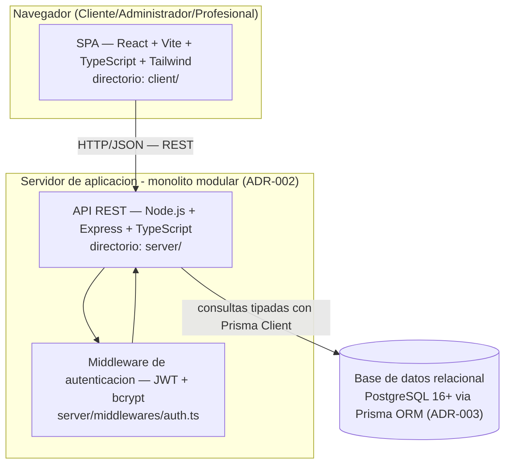

# C4 — Nivel 2: Diagrama de Contenedores

Vista de nivel 2: los contenedores que componen el Sistema de Turnos y los protocolos entre ellos. Cada contenedor es trazable a una decisión registrada en SPEC o ADR.

## Contenedores

## Trazabilidad (ningún contenedor sin fuente)

| Contenedor | Fuente en SPEC / ADR |
|---|---|
| SPA React + Vite + Tailwind | ADR-001 · SPEC sección 4 (Stack) |
| API REST Express + TypeScript | ADR-001 · ADR-002 (monolito modular) · SPEC sección 4 |
| Middleware JWT + bcrypt | ADR-001 · R-05 (SPEC) · CA-05 |
| PostgreSQL + Prisma ORM | ADR-003 · R-02 (SPEC) |
| Protocolo HTTP/JSON (REST sin estado) | R-03 (SPEC) — no se comparte estado entre server y client |

## Decisión de despliegue (para el Sprint 3)

- Desarrollo local: contenedor Docker con PostgreSQL y la API corriendo en el host (SPEC sección 4).
- El SPA y la API se sirven de forma independiente en producción; la naturaleza de monolito modular (ADR-002) mantiene la API como un único artefacto desplegable.