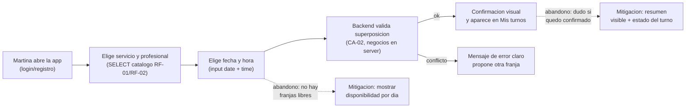
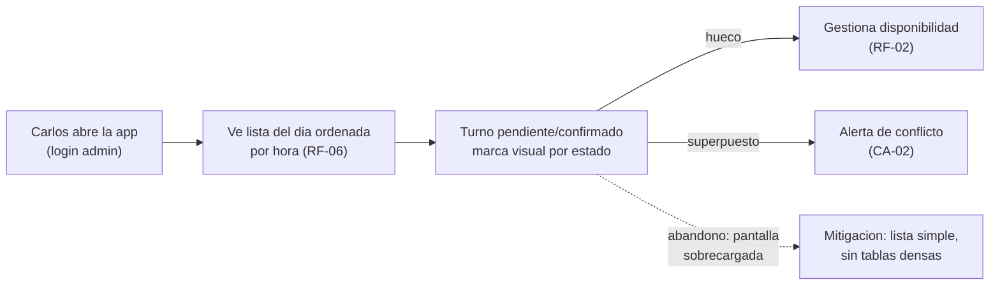

# Personas y User Journeys — Sistema de Turnos

**TP3 ADI · Sprint 2 (T4) · 2026-09-11**

Personas derivadas del dominio real de la SPEC (RF-04 reserva, RF-06 agenda del día, RF-07 cancelación, RF-09 roles). No son genéricas: se construyen a partir de los flujos que la aplicación debe sostener.

---

## 1. Personas

### Persona 1 — Martina, la clienta con horarios rígidos

| Atributo | Detalle |
|---|---|
| Nombre | Martina López, 31, analista contable |
| Rol en el sistema | Cliente (RF-09) |
| Objetivo | Reservar y gestionar su turno en menos de 2 minutos, sin llamar por teléfono |
| Frustración principal | Perdía turnos por sobrecupo: llegaba y había que esperar 40 minutos |
| Contexto de uso | Noche, desde el celular, entre el trabajo y la facultad; conexión inestable a veces |
| Vínculo con SPEC | RF-04 (reserva), RF-07 (cancelación con antelación), RF-03 (consulta de disponibilidad) |

Fricción clave: si el flujo de reserva alarga más de 3 pasos o le pide "pedir disponibilidad" por otro canal, abandona y vuelve al WhatsApp.

### Persona 2 — Carlos, el barbero-administrador

| Atributo | Detalle |
|---|---|
| Nombre | Carlos Fernández, 45, dueño de la barbería (única sucursal, NG-05) |
| Rol en el sistema | Administrador (RF-09, rol ADMIN) |
| Objetivo | Ver la agenda del día de un vistazo y evitar huecos o superposiciones |
| Frustración principal | Gestionaba la agenda en papel; los huecos sin llenar se perdían |
| Contexto de uso | Estación de trabajo, tablet apoyada en el mostrador, pantalla semi-leída entre cortes |
| Vínculo con SPEC | RF-01/RF-02 (alta de servicios y profesionales), RF-06 (turnos del día), RF-08 (dashboard) |

Fricción clave: todo lo que exija más de una mirada de 5 segundos (scroll horizontal, tablas densas) no le sirve; necesita la lista del día legible de arriba abajo.

---

## 2. User Journeys

### Journey 1 — Reserva de turno online (Martina)

Flujo crítico: RF-04 + RF-03, sostiene CA-01 y CA-02. Es la transacción de negocio más frecuente.

Puntos de abandono y mitigación:
- **Sin franjas libres** → mitigación: mostrar qué días/horas tienen disponibilidad antes de confirmar.
- **Incertidumbre post-reserva** → mitigación: resumen en pantalla + el turno aparece al instante en "Mis turnos".

### Journey 2 — Revisar la agenda del día (Carlos)

Flujo crítico: RF-06, sostiene CA-03. Decide la operación diaria del negocio.

Puntos de abandono y mitigación:
- **Sobrecarga visual** → mitigación: una lista legible por hora con estados, sin tablas densas ni scroll horizontal.