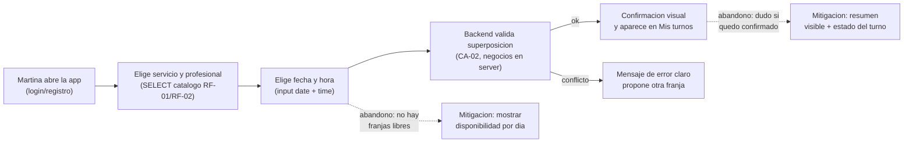
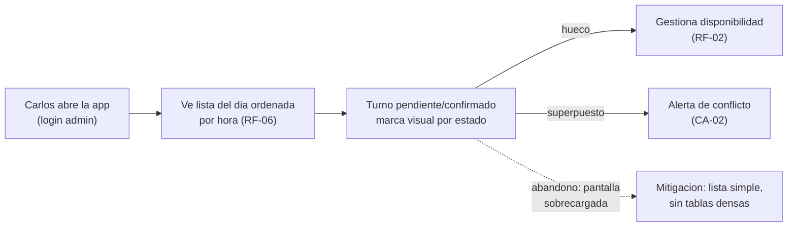
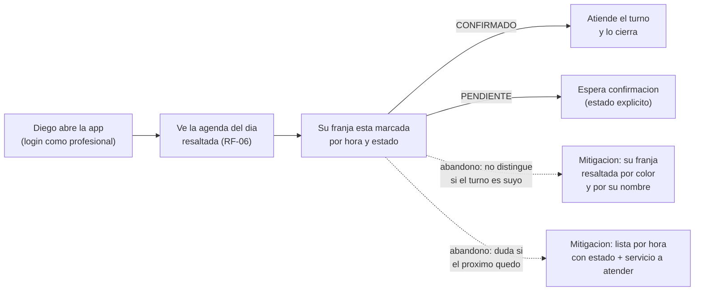

# Personas y User Journeys — Sistema de Turnos

**TP3 ADI · Sprint 2 (T4) · 2026-09-11**

Personas derivadas del dominio real de la SPEC (RF-04 reserva, RF-06 agenda del día, RF-07 cancelación, RF-09 roles). No son genéricas: se construyen a partir de los flujos que la aplicación debe sostener.

---

## 1. Personas

### Persona 1 — Martina, la clienta con horarios rígidos

| Atributo | Detalle |
|---|---|
| Nombre | Martina López, 31, analista contable |
| Rol en el sistema | Cliente (RF-09) |
| Objetivo | Reservar y gestionar su turno en menos de 2 minutos, sin llamar por teléfono |
| Frustración principal | Perdía turnos por sobrecupo: llegaba y había que esperar 40 minutos |
| Contexto de uso | Noche, desde el celular, entre el trabajo y la facultad; conexión inestable a veces |
| Vínculo con SPEC | RF-04 (reserva), RF-07 (cancelación con antelación), RF-03 (consulta de disponibilidad) |

Fricción clave: si el flujo de reserva alarga más de 3 pasos o le pide "pedir disponibilidad" por otro canal, abandona y vuelve al WhatsApp.

### Persona 2 — Carlos, el barbero-administrador

| Atributo | Detalle |
|---|---|
| Nombre | Carlos Fernández, 45, dueño de la barbería (única sucursal, NG-05) |
| Rol en el sistema | Administrador (RF-09, rol ADMIN) |
| Objetivo | Ver la agenda del día de un vistazo y evitar huecos o superposiciones |
| Frustración principal | Gestionaba la agenda en papel; los huecos sin llenar se perdían |
| Contexto de uso | Estación de trabajo, tablet apoyada en el mostrador, pantalla semi-leída entre cortes |
| Vínculo con SPEC | RF-01/RF-02 (alta de servicios y profesionales), RF-06 (turnos del día), RF-08 (dashboard) |

Fricción clave: todo lo que exija más de una mirada de 5 segundos (scroll horizontal, tablas densas) no le sirve; necesita la lista del día legible de arriba abajo.

### Persona 3 — Diego, el profesional que atiende turnos

| Atributo | Detalle |
|---|---|
| Nombre | Diego Molina, 29, barbero empleado del equipo de Carlos (NG-05: única sucursal, varios profesionales) |
| Rol en el sistema | Profesional **sin rol administrativo** (RF-02: alta de profesionales; RF-03: disponibilidad por profesional) |
| Objetivo | Ver de un vistazo su franja del día y qué turno viene, sin tener que administrar nada |
| Frustración principal | Le avisaban por WhatsApp "tenés uno a las 18"; a veces se enteraba tarde y el cliente esperaba |
| Contexto de uso | La misma tablet del mostrador, entre un corte y otro, con la mano a veces ocupada; miradas de pocos segundos |
| Vínculo con SPEC | RF-02 (su alta como profesional), RF-03 (su disponibilidad/franja), RF-06 (agenda del día, lectura de su franja) |

Fricción clave: su base de trabajo (la silla) le oculta la pantalla mientras atiende; si la agenda no le muestra **ya armada su franja** (cuáles turnos son suyos), pierde el turno siguiente sin darse cuenta. Además no quiere tocar nada administrativo: solo necesita **leer su franja** y saber qué turno confirma.

Diferencia clave con Carlos (Persona 2): Carlos administra (RF-06 semana/dashboard, RF-08); Diego **solo lee** la agenda del día en la vista que Carlos ya confirmó. Es el rol de menor carga cognitiva, y la interfaz no debe empujarlo a gestionar.

---

## 2. User Journeys

### Journey 1 — Reserva de turno online (Martina)

Flujo crítico: RF-04 + RF-03, sostiene CA-01 y CA-02. Es la transacción de negocio más frecuente.

Puntos de abandono y mitigación:
- **Sin franjas libres** → mitigación: mostrar qué días/horas tienen disponibilidad antes de confirmar.
- **Incertidumbre post-reserva** → mitigación: resumen en pantalla + el turno aparece al instante en "Mis turnos".

### Journey 2 — Revisar la agenda del día (Carlos)

Flujo crítico: RF-06, sostiene CA-03. Decide la operación diaria del negocio.

Puntos de abandono y mitigación:
- **Sobrecarga visual** → mitigación: lista simple de arriba abajo por hora, sin tablas densas ni scroll horizontal.

### Journey 3 — Saber qué turnos tiene hoy (Diego)

Flujo crítico: RF-03 + RF-06, sostiene CA-01 y CA-03 desde la mirada del ejecutor (el que atiende). Es el flujo que evita que el cliente espere de más.

Puntos de abandono y mitigación:
- **No distinguir sus turnos dentro de la agenda del día** → mitigación: su franja resaltada con color y etiquetada con su nombre; el foco visual va directo a su próxima hora.
- **Incertidumbre sobre el próximo turno confirmado** → mitigación: lista simple por hora con estado explícito (CONFIRMADO / PENDIENTE / CANCELADO) y el servicio a atender.

Nota de accesibilidad (WCAG 2.2 AA): el resaltado de color de la franja **no es el único canal**; cada turno lleva también el estado en texto plano (contraste asegurable, ver `docs/diseno/auditoria-heuristica.md`, criterio 1.4.3 Contraste mínimo).

---

## 3. Consideraciones para el diseño del dashboard (insumo para el wireframe `dashboard.md`)

El dashboard administrativo (RF-08, solo Carlos ADMIN) debe:

1. **Ser legible en 5 segundos**: las métricas (turnos del día, ocupación, servicios más pedidos) en tarjetas grandes, nunca en tablas densas — sostiene CA-02 (ocupación) sin scroll horizontal.
2. **Diferenciar el rol**: la vista administrativa queda reservada al rol ADMIN (RF-09); Diego (persona 3) nunca ve esta pantalla, su entrada es la agenda del día con su franja resaltada (CA-01).
3. **No depender del color como único canal**: cada métrica combina número + texto de estado (etiqueta), cumpliendo WCAG 2.2 AA 1.4.3.
4. **Presentar huecos accionables**: los huecos de la agenda (turnos cancelados, RF-07) se muestran como franjas libres marcadas para llenarlas, conectando con la mitigación del Journey 3.
