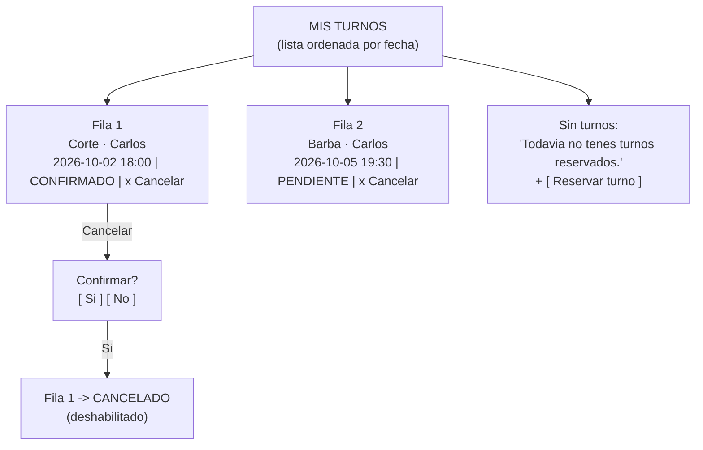

# Wireframe — Pantalla: Mis turnos

**Pantalla crítica 2/2** · gestión del cliente post-reserva (RF-07) y vista de agenda del día para admin (RF-06, variante).

- **Objetivo de la pantalla:** ver de un vistazo los turnos propios ordenados por fecha; cancelar con baja fricción.
- **Entrada principal:** lectura + botón de cancelación.
- **Error más probable del usuario:** cancelar por error → la pantalla previene pidiendo confirmación (H5) y muestra los estados con marca visual (H4/H1).
- **Fallback de estado:** cada fila muestra estado (Pendiente/Confirmado/Cancelado/Completado); la lista recarga tras cada acción.

### Notas de baja fidelidad
- Cada ítem: servicio · profesional · fecha y hora · estado · acción. Nada más (mitigación del journey-2: legible de arriba abajo).
- Estados: texto + punto de color; no se confía solo en el color (contraste AA, accesibles a daltónicos).
- Estados terminales (Cancelado) no muestran acción.

---

## Referencia cruzada TP3

| Entregable | Archivo |
|---|---|
| Personas + journeys | `docs/diseno/usuarios.md` |
| Wireframes | `docs/diseno/wireframes/` |
| Auditoría heurística | `docs/diseno/auditoria-heuristica.md` |
| Stack de UI | `docs/adr/ADR-004-stack-ui.md` |
| SPEC v3 (Gherkin + accesibilidad) | `SPEC.md` |