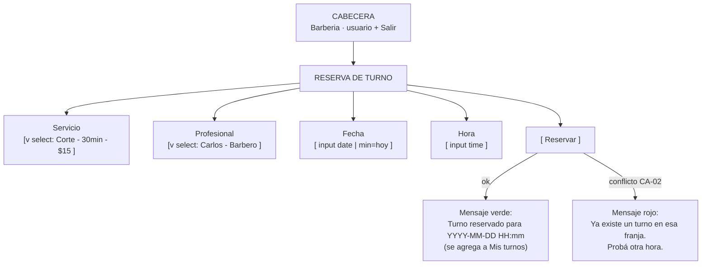

# Wireframe — Pantalla: Reserva de turno

**Pantalla crítica 1/2** · vientre del negocio (RF-04). Autores: Martina (persona 1) reservando desde el celular.

- **Objetivo de la pantalla:** completar una reserva en ≤3 pasos con datos verificables (servicio, profesional, fecha, hora).
- **Entrada principal:** listas desplegables (servicio, profesional) + campos `date`/`time` nativos.
- **Error más probable del usuario:** elegir una fecha pasada o una franja ya ocupada → la pantalla lo previene mostrando disponibilidad y validando antes de cargar (prevención de errores, H5).
- **Fallback de estado:** mensaje de éxito/error visible y anunciado a lectores de pantalla (`aria-live`).

### Notas de baja fidelidad
- Sin colores funcionales: verde/rojo solo de apoyo; la estructura y el flujo es lo que se evalúa.
- El formulario no tiene más campos que los 4 obligatorios para no alargar el journey-1 (punto de abandono).
- El error de superposición llega desde el backend (CA-02); la pantalla lo presenta sin tecnicismos.